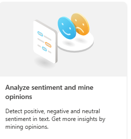
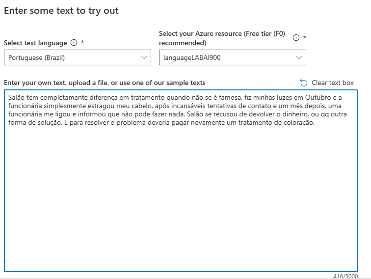
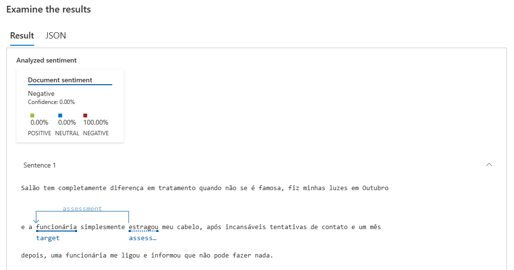
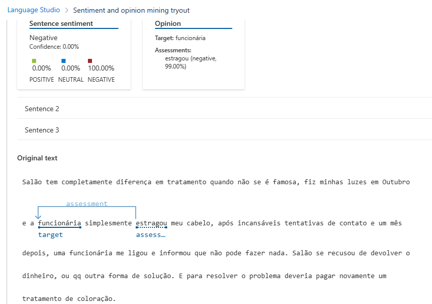
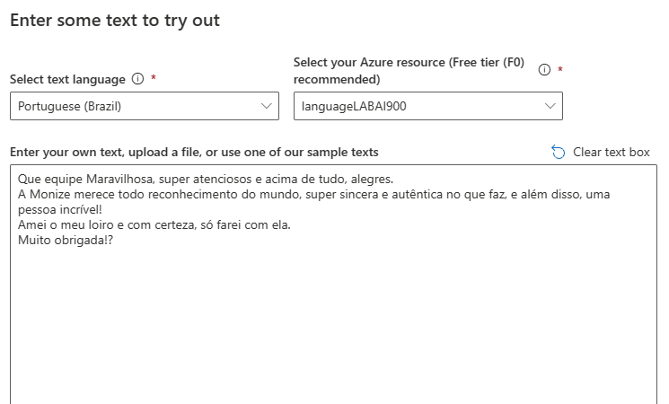
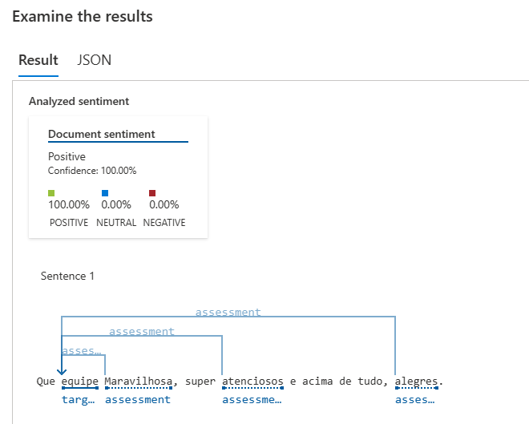
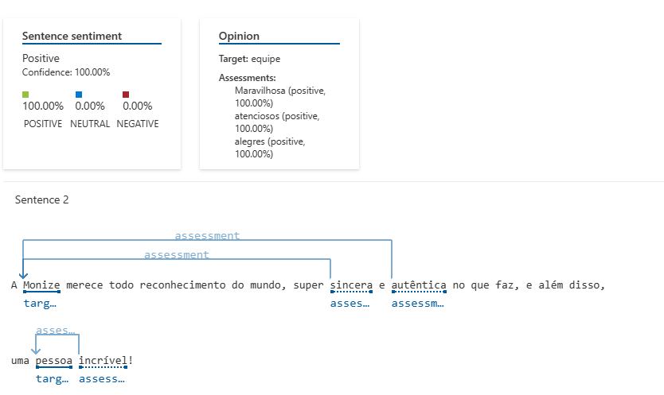
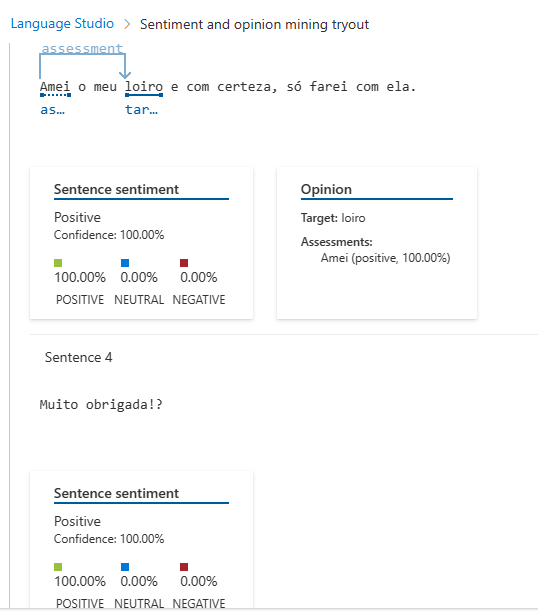

# Desafio 03 - Análise de Sentimentos com Language Studio no Azure AI

Com esse recurso a Inteligência Artificial consegue analizar os textos para descobrir os sentimentos das pessoas, seja algo negativo ou positivo. É um recurso muito importante pois pode facilitar o feedback dos clientes sobre determinado produto ou empresa.

Segue o passo a passo no "https://language.cognitive.azure.com/home" com um exemplo negativo aleatório:

Segue o passo a passo no "https://language.cognitive.azure.com/home" com um exemplo positivo aleatório:

